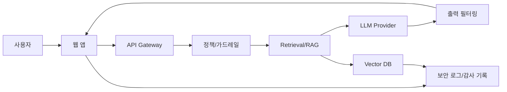

# 2026-02-12 컴플라이언스 패키지 (1/3)

HIPAA Security Rule 준수 증빙과 OWASP LLM Top 10(v1.1) 대응을 위한 **범위/ROE/위험분석** 문서입니다.

본 문서는 운영 시스템에 대한 실침투 지시를 포함하지 않습니다. 모든 검증은 **승인된 환경(스테이징 또는 격리망)**에서 수행해야 합니다.

---

## 1. 목적

- HIPAA Security Rule의 **위험분석(Risk Analysis)** 요구사항을 충족하기 위한 절차와 증빙 구조 정의
- LLM 애플리케이션 보안 통제를 **OWASP LLM Top 10 (v1.1)** 기준으로 매핑
- 감사 대응에 필요한 **문서, 증거, 책임 분담**의 기준 제공

### 근거 자료
- HHS/OCR Risk Analysis Guidance: 위험분석은 Security Rule 준수의 **핵심적 출발점**이며, 방법론은 조직 환경에 맞게 선택하도록 안내됨.
- HHS/OCR FAQ: Security Rule은 **공식 인증을 요구하지 않으며**, HHS는 민간 인증을 인정하지 않음을 명시.
- OWASP LLM Top 10(v1.1): LLM 앱의 10대 주요 리스크 카테고리 정의.

참조 링크는 문서 말미에 정리합니다.

---

## 2. 범위 정의 (Scope)

### 2.1 범위 원칙

- 운영 시스템은 원칙적으로 **제외**
- 승인된 테스트 환경 또는 **격리된 스테이징**에서만 검증
- ePHI가 포함되는 데이터는 **합성 데이터** 또는 마스킹 데이터 사용

### 2.2 범위 파일 예시

```yaml
# scope.yaml (예시)
engagement:
  name: "hipaa-llm-compliance-2026"
  owner: "Security Lead"
  environment: "staging"
  window:
    start: "2026-02-20T09:00:00+09:00"
    end: "2026-02-20T18:00:00+09:00"

targets:
  - name: "llm-web-app"
    url: "https://<STAGING_HOST>/ai_chatbot_main.php?group_idx=1"
    data_class: "no-ephi"

exclusions:
  - "production"
  - "payment"
  - "patient-records"
```

---

## 3. 책임 및 승인 (ROE)

- 승인자: CISO/보안팀장
- 수행자: 보안팀, 개발팀, SRE
- 중단 기준:
  - 지연 증가(예: p95 응답시간 2배 이상)
  - 에러율 증가(예: 5xx 비율 1% 초과)
  - 데이터 무결성 이상 징후

### 3.1 조직 기준 (기본값)

아래는 **조직 기본값 템플릿(예: TalkCRM 기준)**입니다. 실제 담당자/팀명은 내부 표준에 맞게 갱신하세요.

| 역할 | 책임 | 기본값 |
|---|---|---|
| 승인자 | ROE 승인 및 종료 승인 | 보안팀장 |
| 검토자 | 범위/위험 등록부 리뷰 | 서비스 오너 |
| 수행자 | 시나리오 실행/증거 수집 | 보안팀 |
| 협업 | 수정/재배포/관측 | 개발팀/SRE |

### 3.2 테스트 윈도우/중단 기준 (기본값)

- 타임존: `Asia/Seoul (KST)`
- 테스트 윈도우: 평일 09:00~18:00
- 중단 기준(예시):
  - p95 지연: 기준 대비 2배 이상 지속 10분
  - 5xx 에러율: 1% 이상 지속 5분
  - CPU 사용률: 85% 이상 지속 10분
  - DB 커넥션: 풀의 80% 초과 지속 5분

### 3.3 Ralph Loop 방법론 적용 원칙

본 컴플라이언스 패키지는 **Ralph Loop**의 반복 개선 원칙을 적용합니다.

- **작은 단위 작업**: 시나리오는 원자적(Task 단위)으로 분해
- **Pass/Fail 기준**: 각 시나리오에 명확한 통과 기준 정의
- **진행 추적**: 반복마다 결과와 증거를 기록
- **완료될 때까지 반복**: 통과 기준 충족 시까지 루프 실행

---

## 4. 데이터 분류 및 최소화

### 4.1 데이터 분류 예시

```yaml
# data_classification.yaml (예시)
classes:
  - name: "ePHI"
    description: "개인 건강 정보"
    storage: "encrypted"
    logging: "redacted"

  - name: "internal"
    description: "내부 운영 정보"
    storage: "encrypted"
    logging: "allowed"

  - name: "public"
    description: "공개 가능"
    storage: "standard"
    logging: "allowed"
```

### 4.2 로그 마스킹 코드 예시

```python
# security/redaction.py (예시)
import re

ELECTRONIC_PHI_PATTERNS = [
    r"\b\d{6}-\d{7}\b",  # 주민번호 형식 예시
    r"\b\d{3}-\d{2}-\d{4}\b",  # SSN 형식 예시
]

REPLACEMENT = "[REDACTED]"

def redact_ephi(text: str) -> str:
    if not text:
        return text
    redacted = text
    for pattern in ELECTRONIC_PHI_PATTERNS:
        redacted = re.sub(pattern, REPLACEMENT, redacted)
    return redacted
```

---

## 5. 시스템/데이터 흐름 (시각 요소)



---

## 6. HIPAA 위험분석 절차 (Step-by-step)

1. **ePHI 식별**: 생성, 저장, 전송되는 ePHI 범위 정의
2. **자산 식별**: 애플리케이션, 인프라, 저장소, 제3자 서비스 목록화
3. **위협/취약점 식별**: 내부·외부 위협, 구성 오류, 접근 통제 미흡 등
4. **가능성 평가**: 위협 발생 가능성 산정
5. **영향도 평가**: 기밀성/무결성/가용성 영향 산정
6. **위험 등급화**: 가능성 × 영향도 기반 위험 수준 산정
7. **대응 계획 수립**: 완화/수용/전가/회피 전략 선택
8. **문서화 및 업데이트**: 정기 검토, 변경 시 재평가

---

## 7. 위험등록부 템플릿

```yaml
# risk_register.yaml (예시)
- id: RA-001
  asset: "LLM 응답 로그"
  threat: "민감정보 유출"
  vulnerability: "출력 필터 미적용"
  likelihood: "medium"
  impact: "high"
  risk_level: "high"
  mitigation: "출력 필터 적용 및 로그 마스킹"
  owner: "Security"
  status: "planned"

- id: RA-002
  asset: "RAG 인덱스"
  threat: "데이터 노출"
  vulnerability: "권한 검증 미흡"
  likelihood: "low"
  impact: "high"
  risk_level: "medium"
  mitigation: "권한 기반 필터링 적용"
  owner: "Backend"
  status: "in-progress"
```

---

## 8. 산출물 목록

- 범위/ROE 문서
- 자산 목록 및 데이터 흐름도
- 위험분석 보고서
- 위험등록부 및 개선 계획
- 테스트 증거 패키지

---

## 9. 참고 링크

- HHS Risk Analysis Guidance: https://www.hhs.gov/hipaa/for-professionals/security/guidance/guidance-risk-analysis/index.html
- HHS Security Rule Summary: https://www.hhs.gov/hipaa/for-professionals/security/laws-regulations/index.html
- HHS FAQ (Security Rule Certification): https://www.hhs.gov/hipaa/for-professionals/faq/2003/are-we-required-to-certify-our-organizations-compliance-with-the-standards/index.html
- HHS OCR Misleading Claims: https://www.hhs.gov/hipaa/for-professionals/privacy/guidance/be-aware-misleading-marketing-claims/index.html
- OWASP LLM Top 10 v1.1: https://owasp.org/www-project-top-10-for-large-language-model-applications/
