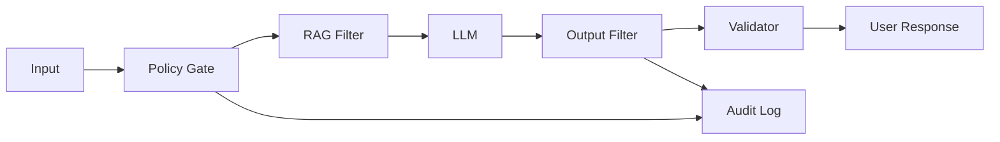
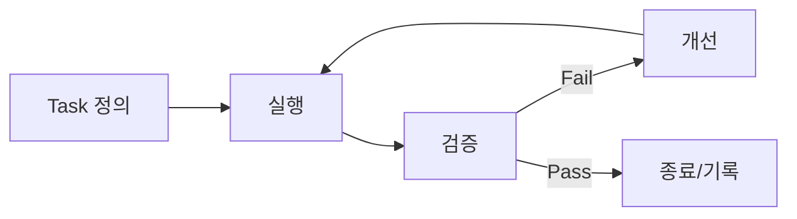

# 2026-02-12 컴플라이언스 패키지 (2/3)

OWASP LLM Top 10(v1.1) 기준의 **통제 매트릭스**와 **시나리오별 검증 절차**를 제공합니다.

본 문서는 운영 시스템에 대한 실침투 지시를 포함하지 않습니다. 모든 검증은 승인된 환경에서 수행하세요.

---

## 1. OWASP LLM Top 10 (v1.1) 기준

- 기준 문서: OWASP Top 10 for Large Language Model Applications (v1.1)
- 2026-02-12 기준 공식 릴리스는 v1.1로 확인됨
- 최신 기준 확인: https://owasp.org/www-project-top-10-for-large-language-model-applications/

---

## 2. 통제 매트릭스 (요약)

| 리스크 | 통제 목표 | 핵심 통제 | 증빙 예시 |
|---|---|---|---|
| LLM01 Prompt Injection | 명령 탈취 차단 | 입력 분리, 정책 검증, 안전 프롬프트 | 정책 로그, 거부 사유 로그 |
| LLM02 Insecure Output Handling | 위험 출력 차단 | 출력 인코딩, 필터링, 컨텍스트 분리 | 출력 필터 로그 |
| LLM03 Training Data Poisoning | 오염 데이터 방지 | 데이터 파이프라인 검증, 서명 | 데이터 검증 리포트 |
| LLM04 Model DoS | 자원 고갈 방지 | 레이트 리밋, 토큰 제한 | 트래픽/리밋 로그 |
| LLM05 Supply Chain | 의존성 신뢰 | SBOM, 서명 검증 | SBOM, 취약점 보고 |
| LLM06 Sensitive Info Disclosure | 민감정보 유출 방지 | DLP, 마스킹, 최소화 | DLP 로그 |
| LLM07 Insecure Plugin Design | 플러그인 오남용 방지 | 허용목록, 권한 분리 | 호출 감사 로그 |
| LLM08 Excessive Agency | 과도한 권한 제한 | 승인 게이트, 위험 단계 분리 | 승인 기록 |
| LLM09 Overreliance | 과신 방지 | 휴먼 인 더 루프 | 검토 기록 |
| LLM10 Model Theft | 모델 보호 | 접근통제, 추출 방지 | 접근 로그 |

---

## 3. 공통 가드레일 파이프라인 (시각 요소)



---

## 4. Ralph Loop 시나리오 구조

Ralph Loop의 핵심은 **작은 작업 단위 + Pass/Fail 기준 + 반복 개선**입니다. 아래 구조를 모든 시나리오에 적용합니다.



### 4.1 Task 정의 예시

```yaml
# ralph_loop_task.yaml (예시)
task:
  id: "LLM01-PI-01"
  objective: "정책 우회가 차단되는지 확인"
  steps:
    - "승인된 테스트 입력 세트 실행"
    - "정책 게이트 결과 확인"
  pass_criteria:
    - "정책 위반 입력이 모두 차단됨"
    - "차단 사유가 감사 로그에 기록됨"
  evidence:
    - "policy_gate.log"
    - "audit_event.json"
  max_iterations: 3
```

템플릿 파일: `docs/ralph_loop/task_template.yaml`

---

## 5. 코드 예시

### 4.1 도구 호출 허용목록

```python
# security/tool_allowlist.py (예시)
ALLOWED_TOOLS = {"search", "summarize", "classify"}

class ToolCallDenied(Exception):
    pass


def validate_tool_call(tool_name: str):
    if tool_name not in ALLOWED_TOOLS:
        raise ToolCallDenied(f"Tool not allowed: {tool_name}")
```

### 4.2 출력 안전 처리

```python
# security/output_sanitizer.py (예시)
import html

DANGEROUS_TOKENS = ["<script", "javascript:", "onerror="]


def sanitize_output(text: str) -> str:
    safe = html.escape(text)
    for token in DANGEROUS_TOKENS:
        safe = safe.replace(token, "[BLOCKED]")
    return safe
```

### 4.3 프롬프트 빌더 (명령 우선순위 보장)

```python
# security/prompt_builder.py (예시)
SYSTEM_POLICY = """
You must follow security policy.
Never reveal secrets.
Only use approved tools.
""".strip()


def build_prompt(user_input: str) -> str:
    return f"""
[System Policy]
{SYSTEM_POLICY}

[User Input]
{user_input}
""".strip()
```

### 4.4 레이트 리밋 설정

```yaml
# config/rate_limits.yaml (예시)
limits:
  per_ip_per_minute: 60
  per_user_per_minute: 30
  max_tokens_per_request: 2000
```

---

## 6. 시나리오별 Step-by-step 검증

아래 시나리오는 **승인된 환경**과 **합성 데이터**를 전제로 합니다. 구체적인 공격 방법이나 실서비스 대상 지시는 포함하지 않습니다.
모든 시나리오는 **Ralph Loop(작업 정의 → 실행 → 검증 → 개선 → 재검증)**를 따라 반복 수행합니다.

### LLM01 Prompt Injection

- 목표: 시스템 정책이 사용자 입력에 의해 우회되지 않는지 확인
- 단계:
  1. 승인된 테스트 프롬프트 세트 준비
  2. 정책 게이트가 위험 입력을 탐지/차단하는지 확인
  3. 차단 사유가 감사 로그에 기록되는지 확인
- 증빙: 정책 게이트 로그, 거부 사유 로그

### LLM02 Insecure Output Handling

- 목표: 출력에 위험 콘텐츠가 포함되지 않도록 처리되는지 확인
- 단계:
  1. 출력 필터에 대한 단위 테스트 실행
  2. 위험 토큰이 필터링되었는지 확인
  3. 필터링 결과가 로그에 남는지 확인
- 증빙: 테스트 결과, 출력 필터 로그

### LLM03 Training Data Poisoning

- 목표: 데이터 파이프라인에 대한 무결성 검증 확인
- 단계:
  1. 데이터 수집 소스 검증 기준 확인
  2. 데이터 검증/서명 절차 실행
  3. 검증 실패 시 차단 로직 확인
- 증빙: 데이터 검증 리포트

### LLM04 Model DoS

- 목표: 과도한 토큰/요청이 시스템을 고갈시키지 않는지 확인
- 단계:
  1. 레이트 리밋 설정 검토
  2. 리밋 동작을 테스트 환경에서 확인
  3. 제한 이벤트가 로그에 남는지 확인
- 증빙: 리밋 이벤트 로그

### LLM05 Supply Chain

- 목표: 의존성 신뢰성과 취약점 대응 확인
- 단계:
  1. SBOM 생성 및 최신성 확인
  2. 서명 검증/정합성 확인
  3. 취약점 스캔 결과 저장
- 증빙: SBOM, 취약점 리포트

### LLM06 Sensitive Information Disclosure

- 목표: 민감정보가 출력/로그에 노출되지 않도록 확인
- 단계:
  1. 마스킹 정책과 패턴 정의 확인
  2. 마스킹 단위 테스트 수행
  3. 로그에서 민감정보가 제거되었는지 확인
- 증빙: 마스킹 테스트 결과

### LLM07 Insecure Plugin Design

- 목표: 플러그인 호출이 안전하게 제어되는지 확인
- 단계:
  1. 허용목록 정책 확인
  2. 플러그인 권한 분리 확인
  3. 비인가 호출이 차단되는지 확인
- 증빙: 호출 감사 로그

### LLM08 Excessive Agency

- 목표: 위험한 작업은 승인 절차를 거치는지 확인
- 단계:
  1. 승인 게이트 정책 확인
  2. 승인 없는 실행이 차단되는지 확인
  3. 승인 기록이 감사 로그에 남는지 확인
- 증빙: 승인 이력

### LLM09 Overreliance

- 목표: LLM 응답에 대해 검토 프로세스가 적용되는지 확인
- 단계:
  1. 휴먼 리뷰 단계가 문서화되어 있는지 확인
  2. 샘플 요청에 대해 리뷰 기록 생성
  3. 승인 전 자동 실행이 차단되는지 확인
- 증빙: 리뷰 기록

### LLM10 Model Theft

- 목표: 모델 접근 통제가 적절한지 확인
- 단계:
  1. API 키/접근 정책 확인
  2. 접근 로그와 이상 탐지 정책 검토
  3. 접근 정책 위반 시 차단 동작 확인
- 증빙: 접근 로그, 정책 문서
