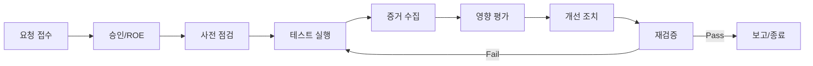

# 2026-02-12 컴플라이언스 패키지 (3/3)

**테스트 실행 절차, 증거 수집, 보고 템플릿**을 제공합니다.

본 문서는 운영 시스템에 대한 실침투 지시를 포함하지 않습니다. 모든 검증은 승인된 환경에서 수행해야 합니다.

---

## 1. 테스트 운영 절차 (Step-by-step)

1. **승인**: ROE 승인, 대상 범위 확인, 윈도우 확정
2. **사전 점검**: 스테이징 상태 확인, 합성 데이터 준비, 모니터링 활성화
3. **테스트 실행**: 승인된 시나리오만 실행
4. **증거 수집**: 로그, 리포트, 스크린샷, 설정 스냅샷
5. **영향 평가**: 지표(응답시간/에러율/CPU) 확인
6. **개선 조치**: 취약점 또는 정책 위반 수정
7. **재검증**: 수정 후 동일 시나리오 재실행
8. **종료 보고**: 최종 보고서 작성 및 아카이브

### 1.1 Ralph Loop 실행 규칙 (기본값)

- 시나리오는 **작은 Task 단위**로 분해
- 각 Task는 **Pass/Fail 기준**을 반드시 포함
- **최대 반복 횟수**: 3회 (기본값)
- 종료 조건: Pass 기준 충족 또는 승인자 판단에 따른 종료

---

## 2. 테스트 수명주기 (시각 요소)



---

## 3. 증거 패키지 구조

```text
compliance-evidence/
  run-2026-02-20/
    manifest.json
    logs/
    metrics/
    screenshots/
    config_snapshots/
    reports/
```

Ralph Loop 실행 폴더 생성:

```bash
python3 scripts/ralph_loop.py init --run-id run-YYYY-MM-DD
```

### 3.1 Manifest 예시

```json
{
  "run_id": "run-2026-02-20",
  "owner": "Security Team",
  "environment": "staging",
  "scope_file": "scope.yaml",
  "artifacts": {
    "logs": ["logs/app.log", "logs/llm_audit.log"],
    "metrics": ["metrics/p95.csv", "metrics/errors.csv"],
    "reports": ["reports/llm_top10_summary.md"],
    "screenshots": ["screenshots/session-1.png"]
  },
  "hashes": {
    "logs/app.log": "sha256:...",
    "reports/llm_top10_summary.md": "sha256:..."
  }
}
```

### 3.2 로그/증거 필드 표준 (기본값)

```json
{
  "timestamp": "2026-02-20T09:15:22Z",
  "request_id": "req-abc123",
  "trace_id": "trace-xyz789",
  "user_id_hash": "sha256:...",
  "session_id": "sess-001",
  "environment": "staging",
  "model": "gpt-4o",
  "provider": "openai",
  "policy_decision": "deny",
  "risk_label": "LLM01",
  "data_class": "no-ephi",
  "tokens_in": 512,
  "tokens_out": 128,
  "latency_ms": 842,
  "evidence_refs": ["logs/llm_audit.log"]
}
```

### 3.3 보존 및 접근 규칙 (기본값)

- 보존 기간: 1년
- 보관 위치: 내부 보안 증거 스토리지(암호화)
- 접근 통제: 보안팀/감사팀 최소 권한
- 무결성: 해시(manifest) 생성 및 서명 저장

### 3.4 AWS CLI 기반 증거 수집 (기본값)

아래는 **읽기 전용** 기준의 증거 수집 예시입니다. 실제 값은 내부 표준에 맞게 교체하세요.

```bash
# 환경 변수 설정 (예시)
export AWS_PROFILE="sungmin"
export AWS_REGION="ap-northeast-2"

# 증거 저장 버킷 (예시)
export EVIDENCE_BUCKET="com.sungmin.networks.talkcrm"
export EVIDENCE_PREFIX="compliance-evidence"
export RUN_ID="run-YYYY-MM-DD"
```

#### 3.4.1 CloudTrail 이벤트 내보내기

```bash
aws cloudtrail lookup-events \
  --start-time "2026-02-20T00:00:00Z" \
  --end-time "2026-02-21T00:00:00Z" \
  --max-results 1000 \
  --output json > cloudtrail-events.json

aws s3 cp cloudtrail-events.json \
  "s3://${EVIDENCE_BUCKET}/${EVIDENCE_PREFIX}/${RUN_ID}/logs/cloudtrail-events.json"
```

#### 3.4.2 CloudWatch Logs 내보내기

```bash
export LOG_GROUP="/aws/lambda/aicc-chat-invoker"

aws logs filter-log-events \
  --log-group-name "${LOG_GROUP}" \
  --start-time 1737321600000 \
  --end-time 1737408000000 \
  --output json > cloudwatch-audit.json

aws s3 cp cloudwatch-audit.json \
  "s3://${EVIDENCE_BUCKET}/${EVIDENCE_PREFIX}/${RUN_ID}/logs/cloudwatch-audit.json"
```

#### 3.4.3 해시 및 매니페스트 생성

```bash
python tools/hash_artifacts.py
aws s3 cp manifest.json "s3://${EVIDENCE_BUCKET}/${EVIDENCE_PREFIX}/${RUN_ID}/manifest.json"
```

#### 3.4.4 최소 권한 IAM 정책 (예시)

```json
{
  "Version": "2012-10-17",
  "Statement": [
    {
      "Effect": "Allow",
      "Action": [
        "cloudtrail:LookupEvents",
        "logs:FilterLogEvents",
        "logs:DescribeLogGroups",
        "logs:DescribeLogStreams"
      ],
      "Resource": "*"
    },
    {
      "Effect": "Allow",
      "Action": [
        "s3:PutObject",
        "s3:ListBucket"
      ],
      "Resource": [
        "arn:aws:s3:::com.sungmin.networks.talkcrm",
        "arn:aws:s3:::com.sungmin.networks.talkcrm/*"
      ]
    }
  ]
}
```

#### 3.4.5 참고 로그 그룹(발견됨)

아래는 **다중 리전 스캔 결과**로 수집된 후보입니다. 실제 사용 여부는 범위/승인에 따라 결정하세요.

| Region | Log Group |
|---|---|
| ap-northeast-1 | /aws/connect/talkcrm-demo |
| ap-northeast-1 | /aws/lambda/connect-bedrock-rag-kyk |
| ap-northeast-2 | /aws/ecs/containerinsights/ecs-talkcrm-prod-penchart/performance |
| ap-northeast-2 | /aws/ecs/containerinsights/ecs-talkcrm-prod-web/performance |
| ap-northeast-2 | /aws/lambda/aicc-bedrock-agent-actions |
| ap-northeast-2 | /aws/lambda/aicc-chat-invoker |
| ap-northeast-2 | /aws/lambda/aicc-crm-integration |
| ap-northeast-2 | /aws/lambda/aicc-mock-crm-api |
| ap-northeast-2 | /aws/lambda/aws_rag_30058 |
| ap-northeast-2 | /aws/lambda/connect-bedrock-rag |
| ap-northeast-2 | /aws/lambda/connect-bedrock-rag-streaming |
| ap-northeast-2 | /aws/lambda/nova-chat-invoker-dev |
| ap-northeast-2 | /aws/rds/cluster/talkcrm-ai-master-public/error |
| ap-northeast-2 | /aws/rds/instance/rds-talkcrm-ae1-prod/error |
| ap-northeast-2 | /aws/rds/instance/rds-talkcrm-master-prod/error |
| ap-northeast-2 | /aws/rds/instance/talkcrm-ai-master-pu/error |
| ap-northeast-2 | /aws/rds/instance/talkcrm-ai-master-pub/error |
| ap-northeast-2 | /aws/rds/instance/talkcrm-ai-master-public/error |
| ap-northeast-2 | /aws/rds/instance/talkcrm-ai-master-public2/error |
| ap-northeast-2 | /aws/rds/instance/talkcrm-ai-master/error |
| ap-northeast-2 | /ecs/prod-talkcrm-api |
| ap-northeast-2 | /ecs/prod-talkcrm-event |
| ap-northeast-2 | /ecs/prod-talkcrm-jubilee |
| ap-northeast-2 | /ecs/prod-talkcrm-landing |
| ap-northeast-2 | /ecs/prod-talkcrm-mail |
| ap-northeast-2 | /ecs/prod-talkcrm-naver-reserve |
| ap-northeast-2 | /ecs/prod-talkcrm-was |
| ap-northeast-2 | /ecs/prod-talkcrm-web |
| ap-northeast-2 | /ecs/talkcrm-backend |
| us-east-1 | /aws/bedrock-agentcore/runtimes/strands_agent-O6OmTQ4ClX-DEFAULT |
| us-east-1 | /aws/bedrock-agentcore/runtimes/strands_agent_fast_route-IndmbUAU5R-DEFAULT |
| us-east-1 | /aws/bedrock-agentcore/runtimes/strands_agent_final-35WCc8HQSo-DEFAULT |
| us-east-1 | /aws/bedrock-agentcore/runtimes/strands_agent_fixed-VgCSCD7uj2-DEFAULT |
| us-east-1 | /aws/bedrock-agentcore/runtimes/strands_agent_v2-Dw4Pzb2h2Q-DEFAULT |
| us-east-1 | /aws/bedrock-agentcore/runtimes/strands_agent_v2-EDcZXsFw4b-DEFAULT |
| us-east-1 | /aws/bedrock-agentcore/runtimes/strands_agent_v3-BIp43kCNV7-DEFAULT |
| us-east-1 | /aws/bedrock-agentcore/runtimes/strands_agent_v3-MYG0m0Exii-DEFAULT |
| us-east-1 | /aws/lambda/lex-kendra-bedrock-yk |
| us-east-1 | /aws/lambda/poc-rag-01 |
| us-east-1 | /aws/rds/instance/talkcrm-ai-db/error |
| us-west-2 | /aws/connect/softcrm-rag-demo |
| us-west-2 | /aws/lambda/connect-bedrock-kyk |
| us-west-2 | /aws/lambda/connect-bedrock-rag-kyk |
| us-west-2 | /aws/lambda/kendra-bedrock-rag |

### 3.5 자동 수집 스크립트 (권장)

읽기 전용 증거 수집을 자동화하려면 아래 스크립트를 사용합니다.

```bash
python3 scripts/aws_evidence_collect.py \
  --profile sungmin \
  --regions ap-northeast-2 us-east-1 \
  --log-group /aws/lambda/aicc-chat-invoker \
  --cloudtrail \
  --start 2026-02-01 \
  --end 2026-02-02 \
  --s3-bucket com.sungmin.networks.talkcrm
```

---

## 4. 코드 예시

### 4.1 해시 생성 스크립트

```python
# tools/hash_artifacts.py (예시)
import hashlib
from pathlib import Path

def sha256_file(path: Path) -> str:
    h = hashlib.sha256()
    with path.open("rb") as f:
        for chunk in iter(lambda: f.read(8192), b""):
            h.update(chunk)
    return h.hexdigest()


def build_hash_manifest(root: Path):
    result = {}
    for p in root.rglob("*"):
        if p.is_file():
            result[str(p)] = f"sha256:{sha256_file(p)}"
    return result
```

### 4.2 테스트 실행 메타데이터 기록

```python
# tools/write_run_metadata.py (예시)
import json
from datetime import datetime


def write_run_metadata(path: str, owner: str, env: str):
    payload = {
        "run_id": f"run-{datetime.utcnow().date()}",
        "owner": owner,
        "environment": env,
        "timestamp": datetime.utcnow().isoformat() + "Z",
    }
    with open(path, "w", encoding="utf-8") as f:
        json.dump(payload, f, indent=2)
```

### 4.3 감사 로그 이벤트 생성

```python
# tools/audit_event.py (예시)
import json
from datetime import datetime


def build_audit_event(request_id: str, decision: str, risk_label: str):
    return {
        "timestamp": datetime.utcnow().isoformat() + "Z",
        "request_id": request_id,
        "decision": decision,
        "risk_label": risk_label,
        "environment": "staging",
    }


def write_audit_event(path: str, event: dict):
    with open(path, "a", encoding="utf-8") as f:
        f.write(json.dumps(event) + "\n")
```

---

## 5. 보고서 템플릿 (요약)

```markdown
# 테스트 요약 보고서

## 개요
- 기간:
- 범위:
- 환경:

## 주요 결과
- 발견사항 수:
- High/Medium/Low 분포:

## HIPAA 위험분석 매핑
- 위험등록부 업데이트:
- 개선 조치:

## OWASP LLM Top 10 매핑
- LLM01:
- LLM02:
- ...

## 부록
- 증거 패키지 위치
- 변경 이력
```

---

## 6. 시나리오 실행 체크리스트

- 사전 승인 완료
- 범위 파일 서명/확정
- 합성 데이터 준비
- 모니터링 활성화
- 테스트 기록 템플릿 준비
- 증거 패키지 경로 생성
- 종료 보고 일정 확정

## 7. 정기 점검 운영 타임라인 (기본값)

1. T-14일: 대상 범위 예고, 윈도우 예비 확정
2. T-7일: ROE/범위 확정, 담당자 배정
3. T-1일: 모니터링/알람 사전 점검
4. T+1일: 결과 공유 및 개선 계획 확정
