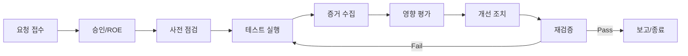

# 2026-02-12 컴플라이언스 패키지 (3/3)

**테스트 실행 절차, 증거 수집, 보고 템플릿**을 제공합니다.

본 문서는 운영 시스템에 대한 실침투 지시를 포함하지 않습니다. 모든 검증은 승인된 환경에서 수행해야 합니다.

---

## 1. 테스트 운영 절차 (Step-by-step)

1. **승인**: ROE 승인, 대상 범위 확인, 윈도우 확정
2. **사전 점검**: 스테이징 상태 확인, 합성 데이터 준비, 모니터링 활성화
3. **테스트 실행**: 승인된 시나리오만 실행
4. **증거 수집**: 로그, 리포트, 스크린샷, 설정 스냅샷
5. **영향 평가**: 지표(응답시간/에러율/CPU) 확인
6. **개선 조치**: 취약점 또는 정책 위반 수정
7. **재검증**: 수정 후 동일 시나리오 재실행
8. **종료 보고**: 최종 보고서 작성 및 아카이브

### 1.1 Ralph Loop 실행 규칙 (기본값)

- 시나리오는 **작은 Task 단위**로 분해
- 각 Task는 **Pass/Fail 기준**을 반드시 포함
- **최대 반복 횟수**: 3회 (기본값)
- 종료 조건: Pass 기준 충족 또는 승인자 판단에 따른 종료

---

## 2. 테스트 수명주기 (시각 요소)



---

## 3. 증거 패키지 구조

```text
compliance-evidence/
  run-2026-02-20/
    manifest.json
    logs/
    metrics/
    screenshots/
    config_snapshots/
    reports/
```

### 3.1 Manifest 예시

```json
{
  "run_id": "run-2026-02-20",
  "owner": "Security Team",
  "environment": "staging",
  "scope_file": "scope.yaml",
  "artifacts": {
    "logs": ["logs/app.log", "logs/llm_audit.log"],
    "metrics": ["metrics/p95.csv", "metrics/errors.csv"],
    "reports": ["reports/llm_top10_summary.md"],
    "screenshots": ["screenshots/session-1.png"]
  },
  "hashes": {
    "logs/app.log": "sha256:...",
    "reports/llm_top10_summary.md": "sha256:..."
  }
}
```

### 3.2 로그/증거 필드 표준 (기본값)

```json
{
  "timestamp": "2026-02-20T09:15:22Z",
  "request_id": "req-abc123",
  "trace_id": "trace-xyz789",
  "user_id_hash": "sha256:...",
  "session_id": "sess-001",
  "environment": "staging",
  "model": "gpt-4o",
  "provider": "openai",
  "policy_decision": "deny",
  "risk_label": "LLM01",
  "data_class": "no-ephi",
  "tokens_in": 512,
  "tokens_out": 128,
  "latency_ms": 842,
  "evidence_refs": ["logs/llm_audit.log"]
}
```

---

## 4. 코드 예시

### 4.1 해시 생성 스크립트

```python
# tools/hash_artifacts.py (예시)
import hashlib
from pathlib import Path

def sha256_file(path: Path) -> str:
    h = hashlib.sha256()
    with path.open("rb") as f:
        for chunk in iter(lambda: f.read(8192), b""):
            h.update(chunk)
    return h.hexdigest()


def build_hash_manifest(root: Path):
    result = {}
    for p in root.rglob("*"):
        if p.is_file():
            result[str(p)] = f"sha256:{sha256_file(p)}"
    return result
```

### 4.2 테스트 실행 메타데이터 기록

```python
# tools/write_run_metadata.py (예시)
import json
from datetime import datetime


def write_run_metadata(path: str, owner: str, env: str):
    payload = {
        "run_id": f"run-{datetime.utcnow().date()}",
        "owner": owner,
        "environment": env,
        "timestamp": datetime.utcnow().isoformat() + "Z",
    }
    with open(path, "w", encoding="utf-8") as f:
        json.dump(payload, f, indent=2)
```

### 4.3 감사 로그 이벤트 생성

```python
# tools/audit_event.py (예시)
import json
from datetime import datetime


def build_audit_event(request_id: str, decision: str, risk_label: str):
    return {
        "timestamp": datetime.utcnow().isoformat() + "Z",
        "request_id": request_id,
        "decision": decision,
        "risk_label": risk_label,
        "environment": "staging",
    }


def write_audit_event(path: str, event: dict):
    with open(path, "a", encoding="utf-8") as f:
        f.write(json.dumps(event) + "\n")
```

---

## 5. 보고서 템플릿 (요약)

```markdown
# 테스트 요약 보고서

## 개요
- 기간:
- 범위:
- 환경:

## 주요 결과
- 발견사항 수:
- High/Medium/Low 분포:

## HIPAA 위험분석 매핑
- 위험등록부 업데이트:
- 개선 조치:

## OWASP LLM Top 10 매핑
- LLM01:
- LLM02:
- ...

## 부록
- 증거 패키지 위치
- 변경 이력
```

---

## 6. 시나리오 실행 체크리스트

- 사전 승인 완료
- 범위 파일 서명/확정
- 합성 데이터 준비
- 모니터링 활성화
- 테스트 기록 템플릿 준비
- 증거 패키지 경로 생성
- 종료 보고 일정 확정
